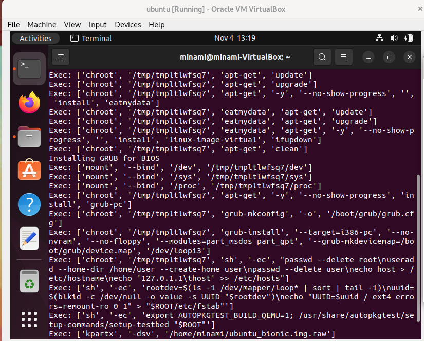
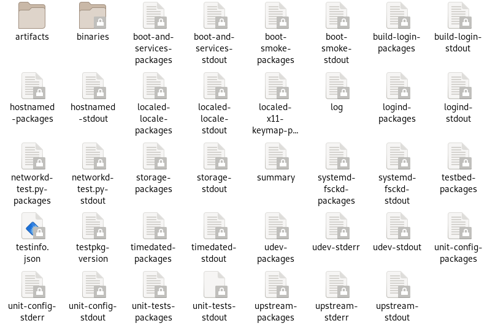

# debian-autopkgtest

这是在对debian的autopkgtest进行调研使用后存放报告的仓库

包括：
 - 事先准备testbed
 - autopkgtest的使用
 - 其在deepin-riscv系统上的测试及跨系统测试遇到的难题


## testbed的制作及使用

    为了对本机系统进行保护，autopkgtest在运行时需要一个与本机系统相隔离的测试环境，称为`testbed`。
    而testbed由于实现方式不同，都有相应的构建方式，以下列出并分析常用的testbed实现方法：
### null
    autopkgtest实际上支持直接在本地文件系统内无隔离的进行测试，虽然官方并不推荐，因为测试时可能损坏本地文件，但这种方式无需testbed的创建，只需直接运行即可，如：
```
sudo autopkgtest --apt-upgrade tkcalendar_1.6.1-1.dsc -- null
```
    缺点：
 - 首先，由于只是在本地编译运行，可能对本地文件系统造成损伤; 
 - 其次，他也不能实现跨架构的进行测试;
 - 再有，有些测试例需要多设备或者恢复重启功能， 单单在本地运行是无法满足测试例需求的，所以会被SKIP

### chroot 
    chroot基本上是计算机上的一个特殊目录，它阻止应用程序（如果从该目录内部运行）访问目录外的文件，chroot就像在现有操作系统中安装另一个操作系统。从技术上讲，chroot会暂时将根目录（通常为/）更改为chroot目录（例如/var/chroot）。由于根目录是文件系统层次结构的顶层，因此应用程序无法访问根目录以外目录，使得应用程序与系统的其余部分隔离，这可以防止chroot中的应用程序干扰计算机上其他位置的文件。

    对于debian原生系统以及ubuntu,可使用debootstrap或mmdebstrap构建一个轻量化的debian文件系统作为testbed，详见debian官网，此处给出例子：
```
debootstrap stable /stable-chroot http://deb.debian.org/debian/
```

### schroot -- mk-sbuild

    schroot使得用户可以在不同的chroot下执行交互命令，chroot只能被root用户使用，schroot可以被普通用户使用，schroot 在chroot的基础上还提供了permissions checking, environmental setup（如filesystem mount等，在autopkgtest-virt-schroot中，debian官方推荐使用mk-sbuild进行testbed的制作，而这也恰好可以制作出适合普通用户交叉编译的系统

### lxc -- autopkgtest-build-lxc

    autopkgtest同样支持容器，其中使用最多的就是lxc,针对这种形式autopkgtest自行配置了一个软件包来对testbed进行构建或进行软件升级,称为autopkgtest-build-lxc，其具体使用本人并没有深入研究，只是贴出debian本地的例子
```
autopkgtest-build-lxc debian sid
```

### qemu -- autopkgtest-build-qemu

    autopkgtest也支持使用qemu作为testbed,其中他使用autopkgtest-build-qemu软件包来进行构建，其又使用了vmdb2来构建qemu的img硬盘，由于目前riscv64的测试多使用qemu,下面详细剖析下其img的构建，以便以后的测试参考：
 - 创建硬盘镜像img,格式为raw,并挂载在tmp的某个新建目录（目录名随机生成）
 - 使用debootstrap在挂载的镜像中创建debian文件系统（其中会根据架构确定dpkg的架构，根据镜像的下载仓库以及版本确定下载的版本）
 - 使用chroot在镜像中进行软件的下载（软件源默认根据镜像源配置，并且只有 main 软件仓库，必装软件有ifupdown,linux-image-virt，grub-pc）
 - 使用grub进行开机的引导。
 - 对root,user进行设置（删除其密码）
 - 配置其host网络
 - 对磁盘进行uuid进行设置
 - 运行本地的autopkgtest的setup-command（其中包含一些优化，以及实现运行时设置的参数的功能之类）\
 下为ubuntu下构建镜像的日志输出



## autopkgtest的使用
```
$ sudo autopkgtest [options...] [testbinary...] testsrc -- virt-server [virt-server-arg...]
```
其中具体option与args可查看debian官网的 [man](https://manpages.debian.org/testing/autopkgtest/autopkgtest.1.en.html)

其中几个细节：
 - virt-server由一开始创建的testbed所对应，如qemu,lxc,null等
 - “--”之后需要有空格......
 - 如果不用-o选项制定日志输出日期的话，日志将全部输出到terminal中，而不会生成文件

### 结果的查看

下为生成文件后具体文件的概览图：



对于其中的日志文件
 - summary文件中为测试的所有测试例的名称以及其具体结果，如：


 - testinfo.json文件里储存的是执行测试的本地环境信息，包括内核版本，一些硬件信息等，如：


 - testbed-packages罗列了进行测试用到的testbed的软件包安装情况及具体版本，即运行测试的软件环境

 - testpkg-version文件指出了测试包的版本

 - 其余文件遵循`testname-*`的格式，其中testname为所执行的测试例的名字，而*可以为packages,stdout,stderr，分别代表了样例安装测试的包和依赖，测试时的正常标准输出日志以及错误信息日志

 ## 在deepin上运行其以及跨系统时遇到的难题

由于autopkgtest为高度集成的软件包，其中有许多函数互相引用且还与其他的软件包相关联（如autopkgtest-build-qemu使用了vmdb2软件包）， 且常用testbed的配置也依赖于debian对远程仓库的相互支持，导致本地的autopkgtest的运行和测试系统的环境结构需要很严谨的配合，从而进行其他debian系系统（如ubuntu,deepin）的测试变得十分困难，不仅testbed的构建困难重重，且运行时同样有许多问题。

而目前deepin-riscv处于开发测试阶段，可供下载的适合qemu进行运行也就一个deepin beige发行版的base file system。之后的启动内核还需自己编译，从而使得测试的不确定性增大了，而由于在本地debain系统运行autopkgtest尚有许多问题，想要运行也就只能在qemu中运行软件包，而在qemu中运行时不可避免的会出现性能损耗的问题，而本来autopkgtest运行时就需连接testbed，在testbed中运行又会造成进一步的性能损耗，从而出现超时的情况，导致测试例的通过率与实际情况有偏差，而autopkgtest的本地模式即null,并不支持备份重启功能，导致有些测试例会被跳过，导致测试例的执行率不高，不能起到全面测试的效果，故目前运行autopkgtest进行测试困难还很多

